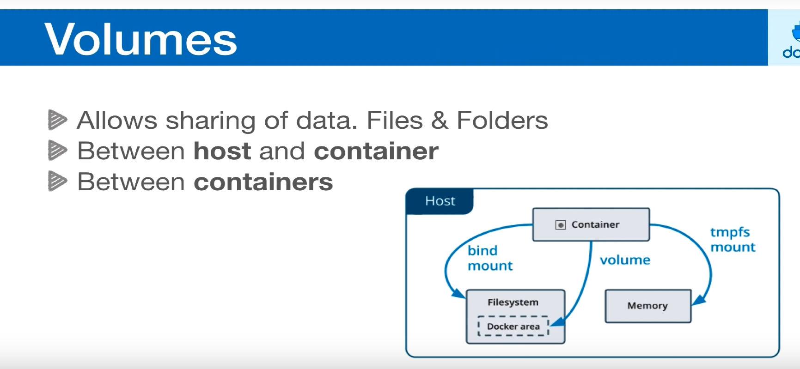
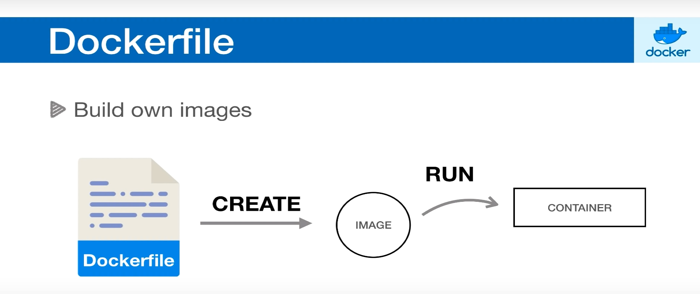
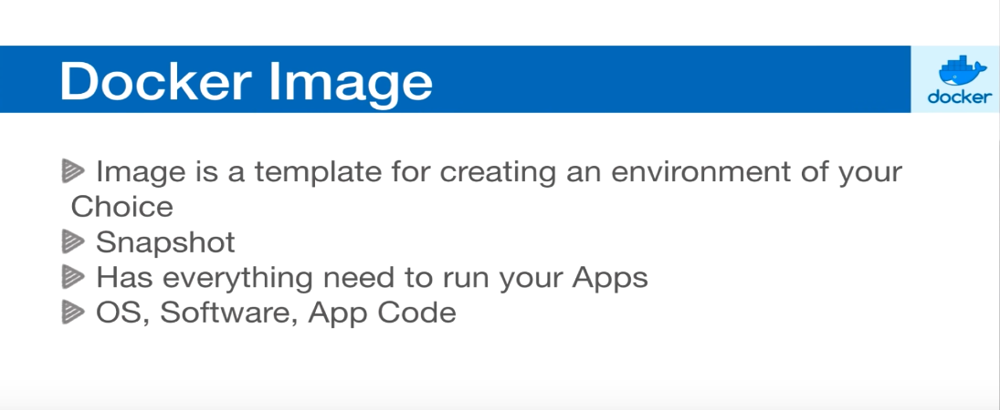

## #commands
~~~
docker ps # show proceses/active containers

docker pull <image_name> # pull any image u want (ex: nginx)

docker run -d <image_name> # run in detached mode in background

docker stop <container_id> # stop the container

docker run -d -p 8080 -p 3000 <image_name> # -p to run container on specified ports only (multiple ports can also be done)

docker rm $(docker ps -aq) # remove all containers -a all -q returns numeric id

docker run --name nginx_1 -p 3000 -d <image_name> # naming your container best practices ( --name <container_name>)

~~~

## #For-getting-better-ps-output-format :

~~~
# for better formating docker ps 
docker ps --format="ID\t{{.ID}}\nNAME\t{{.Names}}\nIMAGE\t{{.Image}}\nPORTS\t{{.Ports}}\nCOMMAND\t{{.Command}}\nCREATED\t{{.CreatedAt}}\nSTATUS\t{{.Status}}\n"

# export it to good variable for easy access 
export FORMAT="ID\t{{.ID}}\nNAME\t{{.Names}}\nIMAGE\t{{.Image}}\nPORTS\t{{.Ports}}\nCOMMAND\t{{.Command}}\nCREATED\t{{.CreatedAt}}\nSTATUS\t{{.Status}}\n"

# and use it like : 
docker ps --formate=$FORMAT

~~~

#  #Volumes 

# #Hosting-basic-static-html-webpage-from-host-directory-inside-a-nginx container :

### need index.html in that directory to host static page
# or 
## use nginx.conf and specify your fille name there do chat-gpt if you don't know how to write that conf file 

~~~
docker run --name nginx_3 -d -v $(pwd):/usr/share/nginx/html:ro -p 8080:80 nginx
~~~

#### -v specifies volume  and (ro(read only content volume)) $(pwd) in that directory you do this where your index.html file is situated only

### to run with config file :

~~~
docker run -p 8080:80 --name nginx_3 -d -v $(pwd)/nginx.conf:/etc/nginx/nginx.conf:ro -v $(pwd):/usr/share/nginx/html:ro nginx
~~~

### Example config for nginx : (in our case for example)

~~~
worker_processes 1;

events {
    worker_connections 1024;
}

http {
    server {
        listen 80;
        server_name localhost;

        location / {
            root /usr/share/nginx/html;
            index home.html;
        }
    }
}
~~~

### Summary  of Config file if you want to know(note it can varry):

This configuration sets up a basic Nginx server to serve a single website from a specified directory, using `home.html` as the default page.

- **`worker_processes`**: Number of worker processes to handle requests.
- **`events`**: Configures how Nginx handles connections.
- **`http`**: Contains HTTP-related configuration.
    - **`server`**: Defines a virtual server with its own settings.
    - **`listen`**: Port for incoming HTTP connections.
    - **`server_name`**: Hostname for the server.
    - **`location`**: Configuration for handling requests to a specific path.
    - **`root`**: Directory where Nginx looks for files.
    - **`index`**: Default file to serve for root URL requests.

#  * #To-get-Interactive-shell-to-peep-into-container :

~~~
docker exec -it <container_name> /bin/bash # it = interactive for my convention
~~~

# #volume-between-containers :

![[volumes_bet_containers_docker.png]]

###  #use--volumes-from tag  
~~~
#sharing data between containers 
# first container
docker run -p 8080:80 --name nginx_1 -d -v $(pwd):/usr/share/nginx/html:ro nginx

#second container where data is gathered from first container
# use volumes-from
docker run -p 8081:80 --name web_copy_nginx_2 --volumes-from nginx_1 -d nginx 

~~~

#  #Dockerfile 

### Dockerfile reference: *https://docs.docker.com/reference/dockerfile/

# #what-is-docker-image

