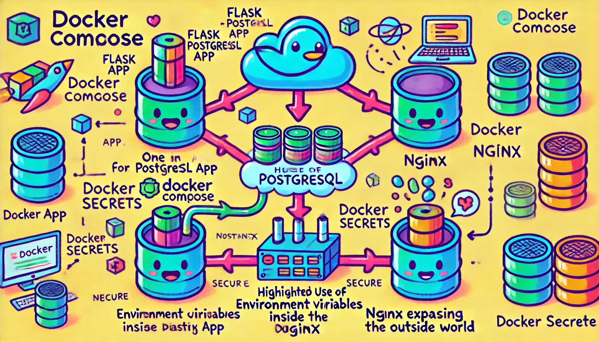

### **Docker Compose Simplified**

Docker Compose helps manage multi-container applications with ease by defining and orchestrating services in a single `docker-compose.yml` file.

---

### **Core Concepts**

1. **Container Networking**:
    
    - Containers within a **Docker network** communicate using their **service names** (e.g., `db` for the PostgreSQL container).
    - No need to expose ports to the host for inter-container communication.
2. **Exposing Services**:
    
    - Use the `ports` directive to map container ports to host ports, enabling external access (e.g., expose Flask or PostgreSQL to the outside world).
3. **Environment Variables**:
    
    - Store configuration like database credentials in environment variables (`POSTGRES_USER`, `POSTGRES_PASSWORD`) to avoid hardcoding sensitive details.
4. **Secrets**:
    
    - Use **Docker Compose Secrets** to securely manage sensitive information like passwords or API keys.
    - Example: Storing credentials in files and using `secrets` to share them with containers.
5. **Security Best Practices**:
    
    - **Use Networks**: Limit exposure by restricting container communication to internal Docker networks.
    - **Restrict Ports**: Only expose necessary ports to the host machine.
    - **Environment Variables**: Avoid sensitive data in plain text.
    - **Secrets**: Use Docker secrets for production environments.
6. **Docker Compose in Practice**:
    
    - Deploy a Flask app (`web`) communicating with a PostgreSQL database (`db`) inside a network.
    - Add a third container like **Nginx** to expose the app to the outside world.
7. **Limitations**:
    
    - Designed for single-host deployments.
    - Complex setups may require orchestration tools like Kubernetes.
    - Secrets management isn't as robust as other tools (e.g., Vault).

---

### **Workflow Recap**

1. **Define Services in `docker-compose.yml`**:
    
    - Services (e.g., Flask app, PostgreSQL, Nginx).
    - Networks and shared volumes.
2. **Start Everything**:
    
    ```bash
    docker-compose up --build
    ```
    
3. **Inter-Container Communication**:
    
    - Use service names for hostname (e.g., `db` for PostgreSQL).
4. **External Access**:
    
    - Map container ports to host ports for external communication.
5. **Test Database Communication**:
    
    - Create tables, insert records, and query data from Flask or host tools.

---

### **Visual Summary**

Refer to the colorful and fun diagram for a simplified explanation of these concepts. Let me know if you’d like further clarification!
